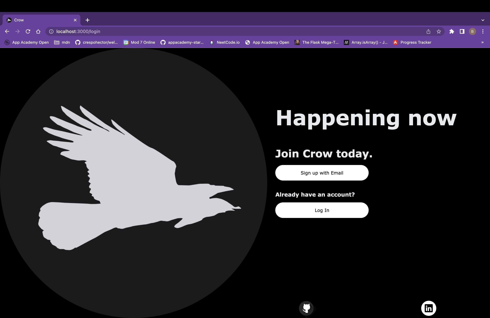
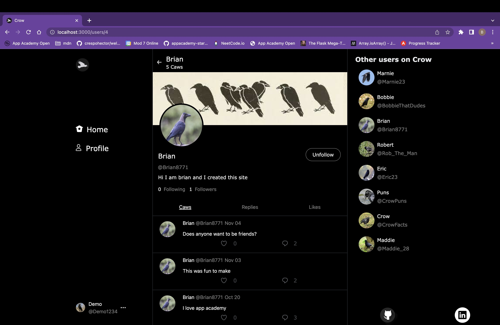

<!-- # Flask React Project

This is the starter for the Flask React project.

## Getting started
1. Clone this repository (only this branch)

   ```bash
   git clone https://github.com/appacademy-starters/python-project-starter.git
   ```

2. Install dependencies

      ```bash
      pipenv install -r requirements.txt
      ```

3. Create a **.env** file based on the example with proper settings for your
   development environment
4. Make sure the SQLite3 database connection URL is in the **.env** file

5. Get into your pipenv, migrate your database, seed your database, and run your Flask app

   ```bash
   pipenv shell
   ```

   ```bash
   flask db upgrade
   ```

   ```bash
   flask seed all
   ```

   ```bash
   flask run
   ```

6. To run the React App in development, checkout the [README](./react-app/README.md) inside the `react-app` directory.


<br>

## Deploy to Heroku
This repo comes configured with Github Actions. When you push to your main branch, Github will automatically pull your code, package and push it to Heroku, and then release the new image and run db migrations.

1. Write your Dockerfile. In order for the Github action to work effectively, it must have a configured Dockerfile. Follow the comments found in this [Dockerfile](./Dockerfile) to write your own!

2. Create a new project on Heroku.

3. Under Resources click "Find more add-ons" and add the add on called "Heroku Postgres".

4. Configure production environment variables. In your Heroku app settings -> config variables you should have two environment variables set:

   |    Key          |    Value    |
   | -------------   | ----------- |
   | `DATABASE_URL`  | Autogenerated when adding postgres to Heroku app |
   | `SECRET_KEY`    | Random string full of entropy |

5. Generate a Heroku OAuth token for your Github Action. To do so, log in to Heroku via your command line with `heroku login`. Once you are logged in, run `heroku authorizations:create`. Copy the GUID value for the Token key.

6. In your Github Actions Secrets you should have two environment variables set. You can set these variables via your Github repository settings -> secrets -> actions. Click "New respository secret" to create
each of the following variables:

   |    Key            |    Value    |
   | -------------     | ----------- |
   | `HEROKU_API_KEY`  | Heroku Oauth Token (from step 6)|
   | `HEROKU_APP_NAME` | Heroku app name    |

7. Push to your `main` branch! This will trigger the Github Action to build your Docker image and deploy your application to the Heroku container registry. Please note that the Github Action will automatically upgrade your production database with `flask db upgrade`. However, it will *not* automatically seed your database. You must manually seed your production database if/when you so choose (see step 8).

8. *Attention!* Please run this command *only if you wish to seed your production database*: `heroku run -a HEROKU_APP_NAME flask seed all`

## Helpful commands
|    Command            |    Purpose    |
| -------------         | ------------- |
| `pipenv shell`        | Open your terminal in the virtual environment and be able to run flask commands without a prefix |
| `pipenv run`          | Run a command from the context of the virtual environment without actually entering into it. You can use this as a prefix for flask commands  |
| `flask db upgrade`    | Check in with the database and run any needed migrations  |
| `flask db downgrade`  | Check in with the database and revert any needed migrations  |
| `flask seed all`      | Just a helpful syntax to run queries against the db to seed data. See the **app/seeds** folder for reference and more details |
| `heroku login -i`      | Authenticate your heroku-cli using the command line. Drop the -i to authenticate via the browser |
| `heroku authorizations:create` | Once authenticated, use this to generate an Oauth token |
| `heroku run -a <app name>` | Run a command from within the deployed container on Heroku | -->
<!-- Incase I need this -->
# Crow Twitter Clone
Crow is a twitter clone designed by Brian Aguilar that is at this moment able to post caws(tweets), comment under a specified caw, follow users, and like caws and comments.


Website link is https://crow-app.onrender.com/

# Login Page


# Homepage


# Profile Page



# Features that are implemented
* User page
   * Able to see all the caws from a specific user as well as their header image and bio on their unique profile page
   * Adding edit profile button where you will be able to change username, bio, profile image and header image

* Caws
   * Able to post a Caw(tweet) that is up to 180 characters
   * Edit Caw by going into the caw details page
   * Delete Caw
   * And view all caws

* Comments
   * Able to post a comment underneath caws that are up to 180 characters
   * Can edit comments
   * Delete comments
   * View all comments from the caw details page

* Follows
   * Able to follow/unfollow users
   * Able see follower count on user profiles
   * Follow button in user profiles
   * Able to see followers and following in each users profile

* Likes
   * If you enjoy what a user said but have nothing to comment you will be able to like it as well.
   * Like button will be under users caw as well as comments.
   * Can view who likes each caw.

* Edit User Profiles
   * Can change Username, header/profile image, and bio.
   * Edit button in user profiles to make accounts more personable to show your personality.


# Languages Used


# Hosted on


# Frameworks used


# Databases Used


